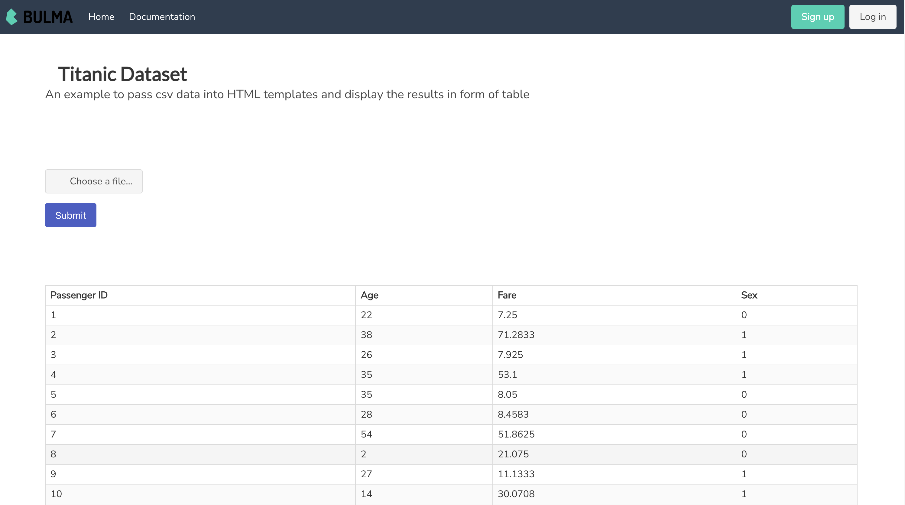

# CSV Parser in HTML, JQuery and Bulma CSS

🌟 Projects loads data from Titanic dataset into a HTML table powered by Bulma CSS 🌟

## Built With

🚀 Technologies used 🚀

- CSS: 🎨
- HTML: 🌐
- jQuery: 🕹️
- JavaScript: 🚀
- [Bulma](https://bulma.io/)

This uses a popular Javascript parser library called PapaParser which helps in parsing data coming from a csv file. All the libraries are imported using CDN so make sure you have internet connection to run this template on your system.

## Screenshots

